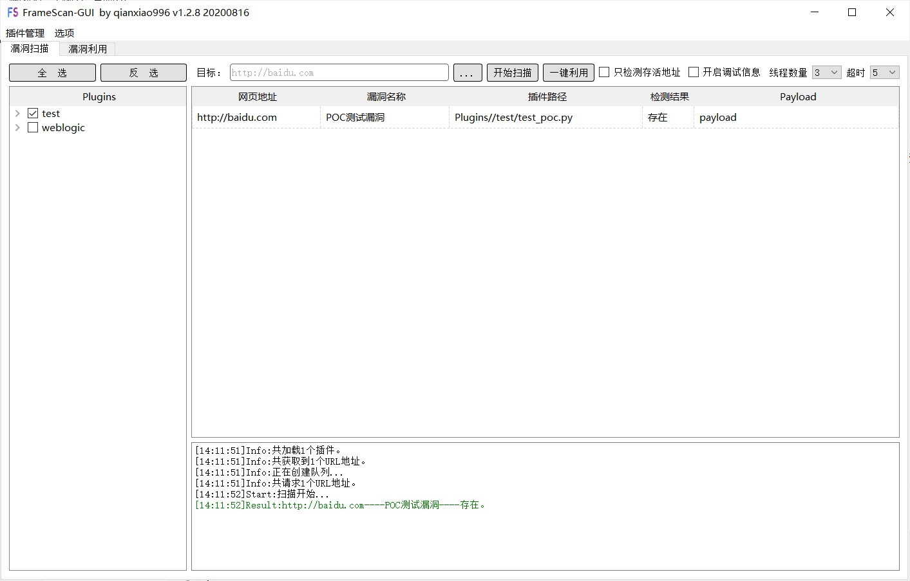

# FrameScan-GUI

## 工具简介
FrameScan-GUI是一款python3和Pyqt编写的具有图形化界面的cms漏洞检测框架，是[FrameScan](https://github.com/qianxiao996/FrameScan) 的加强版。支持多种检测方式，支持大多数CMS，可以自定义CMS类型及自行编写POC。旨在帮助有安全经验的安全工程师对已知的应用快速发现漏洞。
#### 下载地址：https://github.com/qianxiao996/FrameScan-GUI/releases

## 支持平台

- Windows  


### 使用方法

下载本项目，运行exe即可。




## 插件模板

以下为插件模板，请尽量规范编写。脚本中为示例代码。

```python
#!/usr/bin/env python
# -*- coding: utf-8 -*-
import requests

def vuln_info():
    info={
        'vuln_name': 'POC测试漏洞',
        'vuln_referer':'http://baidu.com',
        'vuln_author':'qianxiao996',
        'vuln_description':'''漏洞描述''',
        'vuln_identifier':'''漏洞编号。''',
        'vuln_solution':'''修复建议。''',
        'ispoc':1,
        'isexp':1

    }
    return info
# url：url  hostname：主机地址  port：端口  scheme：服务
def do_poc(url,hostname,port,scheme):
    # 返回参数
    #参数一为返回的类型，参数二结果，参数三为Payload  参数四为输出的颜色（可为空）
    #Result为结果
    #Debug debug信息 默认不会显示，勾选显示调试信息会输出此结果
    #其他均会输出
    result = {"type":'Result', "value":"不存在", "payload":"payload","color":"black"}

    result['value'] = '存在'
    result['payload']= 'payload'
    return result
    

# url:url   heads:自定义请求头 cookie:cookie  exp_type:两个选线（cmd,shell） exp_cmd：命令执行的命令 lhost：反弹shell的IP lport：反弹shell的端口
def do_exp(url,heads='',cookie='',exp_type='cmd',exp_cmd='whoami',lhost='127.0.0.1',lport=8888):
    # 返回参数
    # 参数一为返回的类型，参数二为返回的值，参数三为输出的颜色
    result = {"type":'Result', "value":"root", "color":"black"}
    #命令执行
    if exp_type=='cmd':
        result['value'] = "root"
        return result
    #反弹shell    
    if exp_type=='shell':
        result['type'] = "log"
        result['value'] = "反弹成功"
        result['color'] = "green"
        return result
 
```

插件目录下

插件前缀为"Plugins_ "，请规范编写

## 插件获取

插件为内部使用。需要请编写插件联系作者交换。

邮箱地址：qianxiao996@126.com

## 警告！
**请勿用于非法用途！否则自行承担一切后果**

```
pyinstaller -F FrameScan-GUI.py -i main.ico  --hidden-import eventlet.hubs.epolls --hidden-import eventlet.hubs.kqueue    --hidden-import  eventlet.hubs.selects --hidden-import dns --hidden-import dns.dnssec --hidden-import dns.e164  --hidden-import dns.hash  --hidden-import dns.namedict  --hidden-import   dns.tsigkeyring --hidden-import dns.update --hidden-import dns.version --hidden-import dns.zone -w
```

