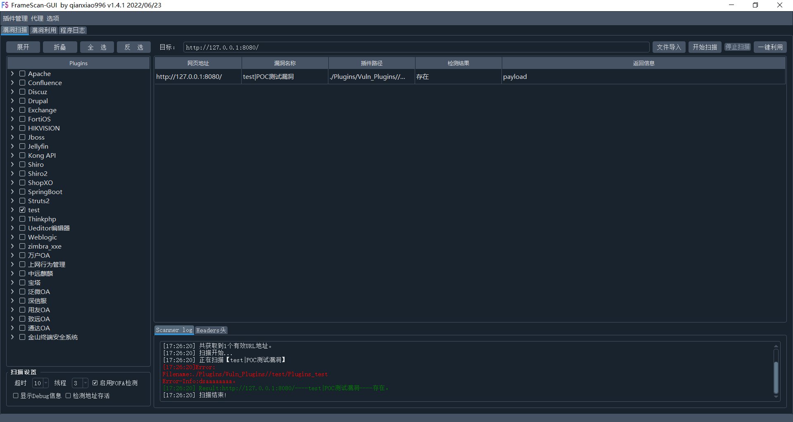
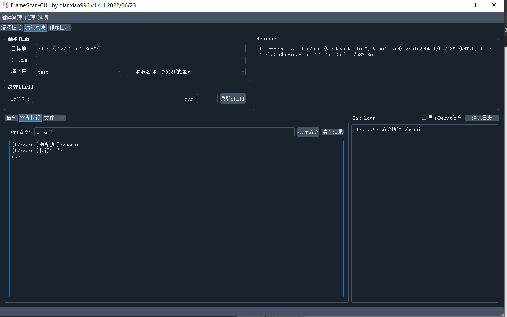
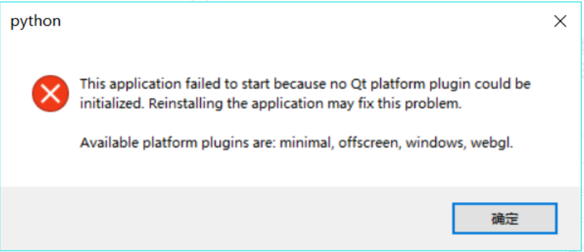

# FrameScan-GUI

## 工具简介
FrameScan-GUI是一款python3和Pyqt编写的具有图形化界面的cms漏洞检测框架，是[FrameScan](https://github.com/qianxiao996/FrameScan) 的加强版。支持多种检测方式，支持大多数CMS，可以自定义CMS类型及自行编写POC。旨在帮助有安全经验的安全工程师对已知的应用快速发现漏洞。
### 下载地址：

https://github.com/qianxiao996/FrameScan-GUI/releases

## 支持平台

- Windows  
- Linux


## 使用方法

下载本项目，运行exe即可。







## 插件模板

以下为插件模板，请尽量规范编写。脚本中为示例代码。

```python
# -*- coding: UTF-8 -*-
#!/usr/bin/python
import sys

import requests,argparse,os
from urllib.parse import urlparse
try:
    import frozen_dir
    #框架引用调用/Plugins/Modules/目录下文件。
    ysoserial  = frozen_dir.app_path() + "/Plugins/Modules/xxx文件名.jar"
except:
    #单文件执行调用当前目录文件
    ysoserial = 'xxx文件名.jar'

def vuln_info():
    vuln_info = {
        "vuln_name":"POC测试漏洞",  #漏洞名称
        'vuln_referer':'http://baidu.com',  #漏洞来源
        'vuln_author':'qianxiao996',  #插件作者
        'cms_name':'test',#cms_name需要和上级目录保持一致。扫描器自动添加会调用。GUI版本不会调用
        'vuln_description':'''漏洞描述''',
        'vuln_identifier':'''漏洞编号。''',
        'vuln_class':'漏洞分类',#如：信息泄漏、远程命令执行、任意文件上传、SQL注入、XML注入、任意文件读取、本地文件包含、认证绕过/未认证、弱口令、目录遍历、其他、反序列化漏洞、OGNL表达式注入、SSRF、后门、任意文件下载、鉴权绕过、暴力破解、命令注入、路径泄露、XSS、远程文件包含、CSRF、任意文件包含、代码注入、任意文件写入、密码硬编码、文件包含、任意用户注册、缓冲区溢出、用户枚举漏洞、任意文件删除、任意页面上传、管理权限等
        'vuln_solution':'''修复建议。''',
        'FofaQuery_type':'socket', #socket、http
        'FofaQuery_link':'/', #此处的路径会加在url拼接访问，进行FofaQuery的条件匹配 此处为all为全部页面都检测
        'FofaQuery_rule':'title="百度"',#header="JSESSIONID" || body="Struts Problem Report" || body="There is no Action mapped for namespace" || body="No result defined for action and result input" || header="Servlet" || header="JBoss",port="60001"
        #header', 'body', 'title', 'banner','port','banner','service','protocol','server'
        'ispoc':0, #是否有poc  1为有 0为无
        'isexp':1  #是否有exp   1为有 0为无
    }
    return vuln_info
def _out(type,text):
    print("[*] "+type+":\n    "+text)
# func_out 输出函数对象  url：url  hostname：主机地址  port：端口  scheme：服务  heads：http自定义头信息
# plugins_temp_data 全局变量，可存储数据至do_exp使用
def do_poc(url,hostname,port,scheme,heads={},func_out=_out,plugins_temp_data={}):
    try:
        #存储数据至do_exp函数使用
        plugins_temp_data['key']='11'

        # func_out('Debug',"debug信息")
        func_out('Error',"错误信息",)
        # func_out('Info',"info信息")
        # 返回参数
        #Result返回是否存在，
        #Result_Info为返回的信息，可以为Paylaod 
        #Debug debug信息 默认不会显示，勾选显示调试信息会输出此结果
        #Error_Info无论何时都会输出
        result = {"Result":False,"Result_Info":""}
        result['Result'] = True
        result['Result_Info']= url
        return result
    except Exception as e:
        func_out('Error',str(e)+str(e.__traceback__.tb_lineno)+'行')


#exp_data
# {
#     "type":"cmd",  #cmd,shell,uploadfile
#     "command":"whoami",  #cmd命令
#     "reverse_ip":"127.0.0.1", #反弹shell的ip
#     "reverse_port":"8888", #反弹shell的端口
#     "filename":"conf.php", #写入文件的名字
#     "filename_contents":"shell内容", #shell文件内容
# }
# url:url   hostname：主机地址  port：端口  scheme：服务  heads:自定义请求头  func_out 输出函数对象
def do_exp(url,hostname,port,scheme,heads={},exp_data={},func_out=_out,plugins_temp_data={}):
    # 返回参数
    # Result返回是否成功，
    # Result_Info为返回的信息，可以为Paylaod
    result = {"Result": False, "Result_Info": ""}
    try:

        #获取全局变量数据
        key = plugins_temp_data.get('key')

        #输出各种信息。参数一类型，默认Debug，可选【Debug、Error、Info】 参数二位具体内容
        func_out('Debug',"debug信息")
        func_out('Error',"错误信息",)
        func_out('Info',"info信息")
        
        #命令执行
        if exp_data['type']=='cmd':
            ##处理你的命令执行
            result['Result'] = True
            result['Result_Info'] = "root"
            result['Result_Info'] =plugins_temp_data

        #反弹shell    
        elif exp_data['type']=='shell':
            ##处理你的反弹shell
            result['Result'] = True
            result['Result_Info'] = "反弹成功"
        #上传文件    
        elif exp_data['type']=='uploadfile':
            ##处理你的上传操作
            result['Result'] = True
            result['Result_Info'] = "上传成功"
    except Exception as e:
        func_out('Error',str(e)+str(e.__traceback__.tb_lineno)+'行')
    return result


if __name__== '__main__':
    #2.创建解析器
    parser = argparse.ArgumentParser()
    # 3.添加参数
    url_file = parser.add_mutually_exclusive_group(required=True)
    url_file.add_argument("-u", "--url",type=str, default="")
    url_file.add_argument("-f", "--file",type=str, default="")

    parser.add_argument("-m","--mode", type=str, default="poc",help="poc or exp",required =False,choices =["poc","exp","cmd","shell","upload"])

    mxgroup = parser.add_mutually_exclusive_group(required=False)
    mxgroup.add_argument("--cmd", type=str, default="whoami",help="cmd",required =False)
    mxgroup.add_argument("--shell", type=str, default="127.0.0.1:8080",help="shell",required =False)
    mxgroup.add_argument("--upload", type=str, default="shell.php",help="upload filepath",required =False)
    print("漏洞信息如下：")
    vuln_info = vuln_info()
    try:
        import prettytable
        table = prettytable.PrettyTable()
        table.field_names = ['字段名称','值']
        for i in vuln_info:
            table.add_row([i,vuln_info[i]])
        print(table)
    except:
        for i in vuln_info:
            print("\t"+str(i)+"："+str(vuln_info[i]))
    print("\n[*] 开始执行...")
    
    # 4.解析参数
    hp = parser.parse_args()
    all_url= []
    if hp.file:
        f=open(hp.file,encoding='utf-8')
        file_Data = f.read()
        f.close()
        all_url = str(file_Data).splitlines()
    else:
        all_url.append(hp.url)

    if hp.mode =='poc':
        for i in all_url:
            _url = urlparse(i)
            # print(_url)
            hostname = _url.hostname
            port = _url.port
            scheme = _url.scheme
            result = do_poc(i,hostname,port,scheme)
            print("[*] URL:"+i+"\n[+] 检测结果:"+("Success" if result.get("Result") else "Faile")+"\t返回信息:"+result.get("Result_Info")+"\n" )

    elif vuln_info.get('isexp'):
        if hp.mode =='cmd':
            exp_data=  {
                "type":"cmd",  #cmd,shell,uploadfile
                "command":hp.cmd  #cmd命令
            }
        elif hp.mode =='shell':
            exp_data=  {
                "type":"shell",  #cmd,shell,uploadfile
                "reverse_ip":hp.shell.split(":")[0], #反弹shell的ip
                "reverse_port":hp.shell.split(":")[1] #反弹shell的端口
            }
        elif hp.mode =='upload':
            try:
                filedata_=open(hp.upload,encoding="utf-8").read()
            except:
                filedata_=open(hp.upload,encoding="gb2312").read()
            exp_data=  {
                "type":"uploadfile",  #cmd,shell,uploadfile
                "filename":os.path.basename(hp.upload),
                "filename_contents":filedata_
            }
        else:
            exp_data=  {
                "type":"cmd",  #cmd,shell,uploadfile
                "command":"whoami",  #cmd命令
            }
        for i in all_url:
            _url = urlparse(i)
            # print(_url)
            hostname = _url.hostname
            port = _url.port
            scheme = _url.scheme
            result = do_exp(i,hostname,port,scheme,heads={},exp_data=exp_data)
            print("[*] URL:"+i+"\n[+] 执行结果:"+("Success" if result.get("Result") else "Faile")+"\n"+result.get("Result_Info")+"\n")
    else:
        print("[E] 该漏洞没有EXP！")
    print("[*] 运行完毕！")


```

插件目录下

插件前缀为"Plugins_ "，请规范编写

## 插件获取

插件为内部使用。需要请编写插件联系作者交换。

邮箱地址：qianxiao996@126.com

## 打包pyd  so

```
# python3 setup.py build_ext --inplace
```

setup.py

```
# -*- coding:utf-8 -*-
# @Time      :2020/4/20
from distutils.core import setup
from Cython.Build import cythonize

setup(
    name='Plugins_test',
    ext_modules=cythonize("Plugins_test.py"),
)

# python3 setup.py build_ext --inplace
```

# 环境安装

本程序采用python3.7+PySide6开发。

```
Pysocks
PySide6
requests
pyperclip
chardet
eventlet
```

## PySide6安装

采用命令安装，Win+R，输入CMD，打开命令框，输入以下命令。后面是豆瓣的镜像地址，是为了加快下载速度。

```
pip install PySide6 -i https://pypi.douban.com/simple
```

## 程序目录说明
├─Conf    程序配置文件目录
│  └─qm   qt邮件英文汉化库
├─Logs   程序日志目录
├─Modules   自定义模块目录，直接引用模块名即可
│  ├─fake_useragent  第三方库
│  └─ 自定义其他模块
├─Plugins
│  ├─Exp_Plugins  Shell文件目录
│  ├─Plugins_Template  插件test模板，新增插件调用此文件
│  └─Vuln_Plugins  所有的漏洞插件
│      ├─Apache    cms名称
│      │  └─ 插件名称 以Plugins_ 开头
│      ├─...
│      │  └─...
└─QSS  版本更新用不到了
    └─mac
# 警告！

**请勿用于非法用途！否则自行承担一切后果**

