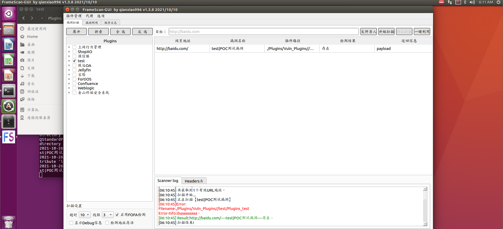

# FrameScan-GUI

## 工具简介
FrameScan-GUI是一款python3和Pyqt编写的具有图形化界面的cms漏洞检测框架，是[FrameScan](https://github.com/qianxiao996/FrameScan) 的加强版。支持多种检测方式，支持大多数CMS，可以自定义CMS类型及自行编写POC。旨在帮助有安全经验的安全工程师对已知的应用快速发现漏洞。
### 下载地址：

https://github.com/qianxiao996/FrameScan-GUI/releases

## 支持平台

- Windows  
- Linux


## 使用方法

下载本项目，运行exe即可。




## 插件模板

以下为插件模板，请尽量规范编写。脚本中为示例代码。

```python
# -*- coding: UTF-8 -*-
#!/usr/bin/python
import requests
def vuln_info():
    info={
        'vuln_name': 'POC测试漏洞',  #漏洞名称
        'vuln_referer':'http://baidu.com',  #漏洞来源
        'vuln_author':'qianxiao996',  #插件作者
        'cms_name':'test',#cms_name需要和上级目录保持一致。扫描器自动添加会调用。GUI版本不会调用
        'vuln_description':'''漏洞描述''',
        'vuln_identifier':'''漏洞编号。''',
        'vuln_class':'漏洞分类',#如：信息泄漏、远程命令执行、任意文件上传、SQL注入、XML注入、任意文件读取、本地文件包含、认证绕过/未认证、弱口令、目录遍历、其他、反序列化漏洞、OGNL表达式注入、SSRF、后门、任意文件下载、鉴权绕过、暴力破解、命令注入、路径泄露、XSS、远程文件包含、CSRF、任意文件包含、代码注入、任意文件写入、密码硬编码、文件包含、任意用户注册、缓冲区溢出、用户枚举漏洞、任意文件删除、任意页面上传、管理权限等
        'vuln_solution':'''修复建议。''',
        'FofaQuery_type':'socket', #socket、http
        'FofaQuery_link':'/', #此处的路径会加在url拼接访问，进行FofaQuery的条件匹配 此处为all为全部页面都检测
        'FofaQuery_rule':'title="百度"',#header="JSESSIONID" || body="Struts Problem Report" || body="There is no Action mapped for namespace" || body="No result defined for action and result input" || header="Servlet" || header="JBoss",port="60001"
        #header', 'body', 'title', 'banner','port','banner','service','protocol','server'
        'ispoc':1, #是否有poc  1为有 0为无
        'isexp':1  #是否有exp   1为有 0为无
    }
    return info
# url：url  hostname：主机地址  port：端口  scheme：服务  heads：http自定义头信息
def do_poc(url,hostname,port,scheme,heads={}):
    try:
    # 返回参数
    #Result返回是否存在，
    #Result_Info为返回的信息，可以为Paylaod 
    #Debug debug信息 默认不会显示，勾选显示调试信息会输出此结果
    #Error_Info无论何时都会输出
        result = {"Result":True,"Result_Info":"payload","Debug_Info":"","Error_Info":""}
        result['Result_Info']= 'payload'
        result['Debug_Info']  = 'ddd'
        result['Error_Info'] = "dsaaaaaaaa"
    except Exception as e:
        result['Error_Info'] = str(e)+str(e.__traceback__.tb_lineno)+'行'
    return result
    
    # {
    #     "type":"cmd",  #cmd,shell,uploadfile
    #     "command":"whoami",  #cmd命令
    #     "reverse_ip":"127.0.0.1", #反弹shell的ip
    #     "reverse_port":"8888", #反弹shell的端口
    #     "filename":"conf.php", #写入文件的名字
    #     "filename_contents":"shell内容", #shell文件内容
    # }
# url:url   hostname：主机地址  port：端口  scheme：服务  heads:自定义请求头 
def do_exp(url,hostname,port,scheme,heads={},exp_data={}):
    try:
    # 返回参数
    #Result返回是否成功，
    #Result_Info为返回的信息，可以为Paylaod 
    #Debug debug信息 默认不会显示，勾选显示调试信息会输出此结果
    #Error_Info无论何时都会输出
        result = {"Result":False,"Result_Info":"payload","Debug_Info":"","Error_Info":""}
        #命令执行
        if exp_data['type']=='cmd':
            result['Result'] = True
            result['Result_Info'] = "root"
        #反弹shell    
        if exp_data['type']=='shell':
            result['Result'] = True
            result['Result_Info'] = "反弹成功"
        #上传文件    
        if exp_data['type']=='uploadfile':
            result['Result'] = True
            result['Result_Info'] = "上传成功"

        # 
        result['Debug_Info'] = "1"
    except Exception as e:
        result['Error_Info'] = str(e)+str(e.__traceback__.tb_lineno)+'行'
    return result


if __name__== '__main__':
    url='http://127.0.0.1/'
    # aa= do_exp(url,'','','','',exp_data)
    # print(aa)
    aa = do_poc(args.url,'','','',heads={})
    print(aa)

```

插件目录下

插件前缀为"Plugins_ "，请规范编写

## 插件获取

插件为内部使用。需要请编写插件联系作者交换。

邮箱地址：qianxiao996@126.com

## 打包pyd  so

```
# python3 setup.py build_ext --inplace
```

setup.py

```
# -*- coding:utf-8 -*-
# @Time      :2020/4/20
from distutils.core import setup
from Cython.Build import cythonize

setup(
    name='Plugins_test',
    ext_modules=cythonize("Plugins_test.py"),
)

# python3 setup.py build_ext --inplace
```

# 环境安装

本程序采用python3.7+pyqt5开发。

```
Pysocks
PyQt5
requests
pyperclip
chardet
eventlet
```

## PyQt5

采用命令安装，Win+R，输入CMD，打开命令框，输入以下命令。后面是豆瓣的镜像地址，是为了加快下载速度。

```
pip install PyQt5 -i https://pypi.douban.com/simple
```

安装Qt的工具包

```
pip install PyQt5-tools -i https://pypi.douban.com/simple
```

# 警告！

**请勿用于非法用途！否则自行承担一切后果**

